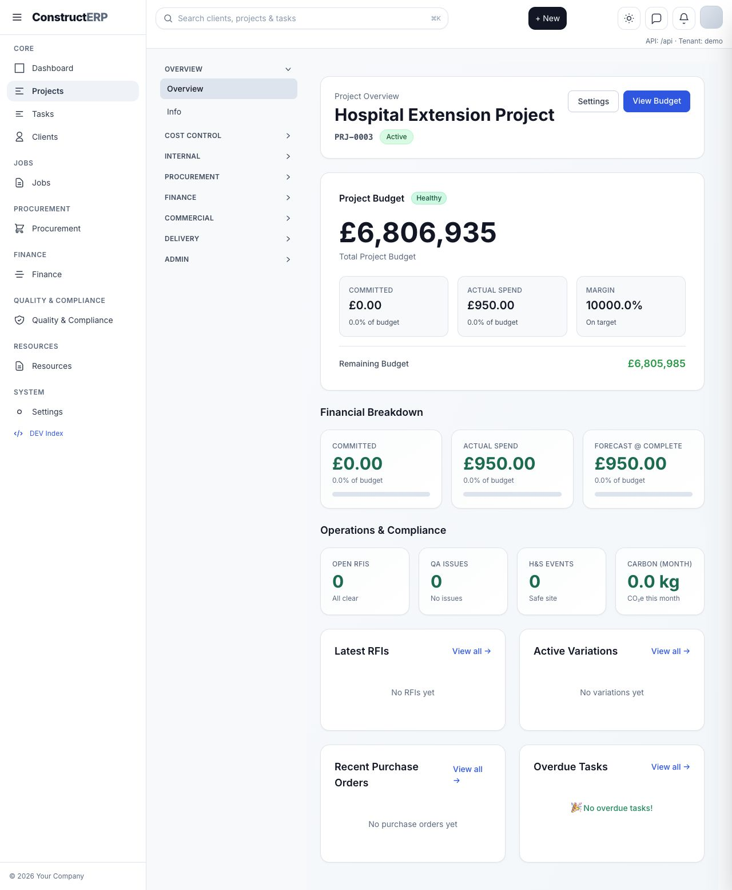
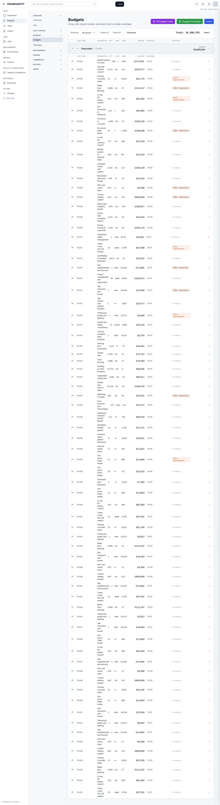
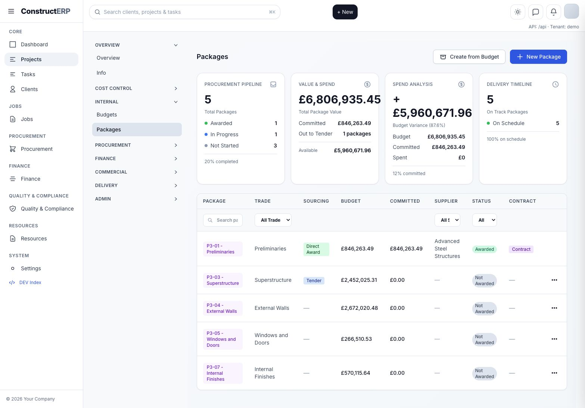
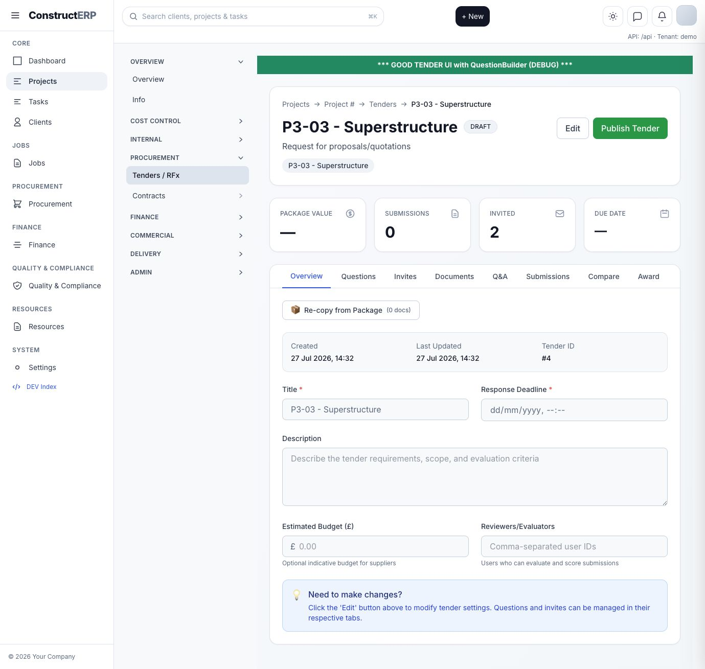
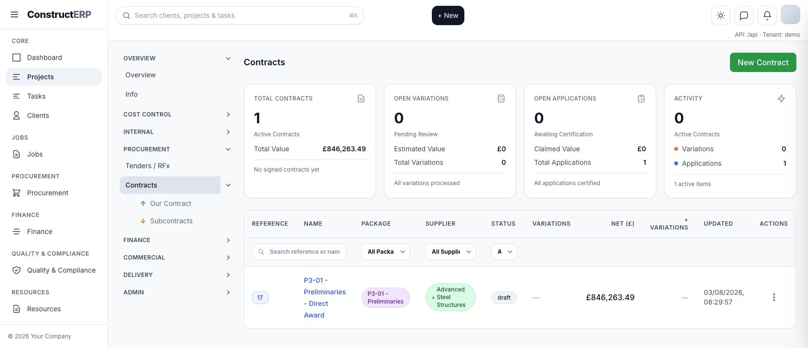
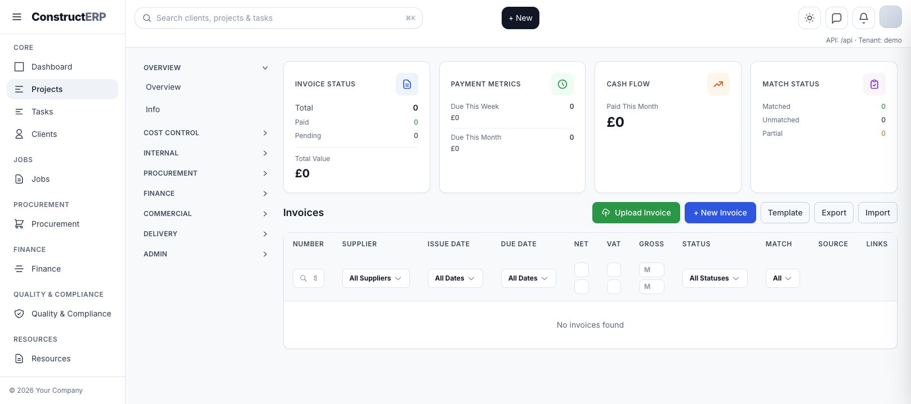
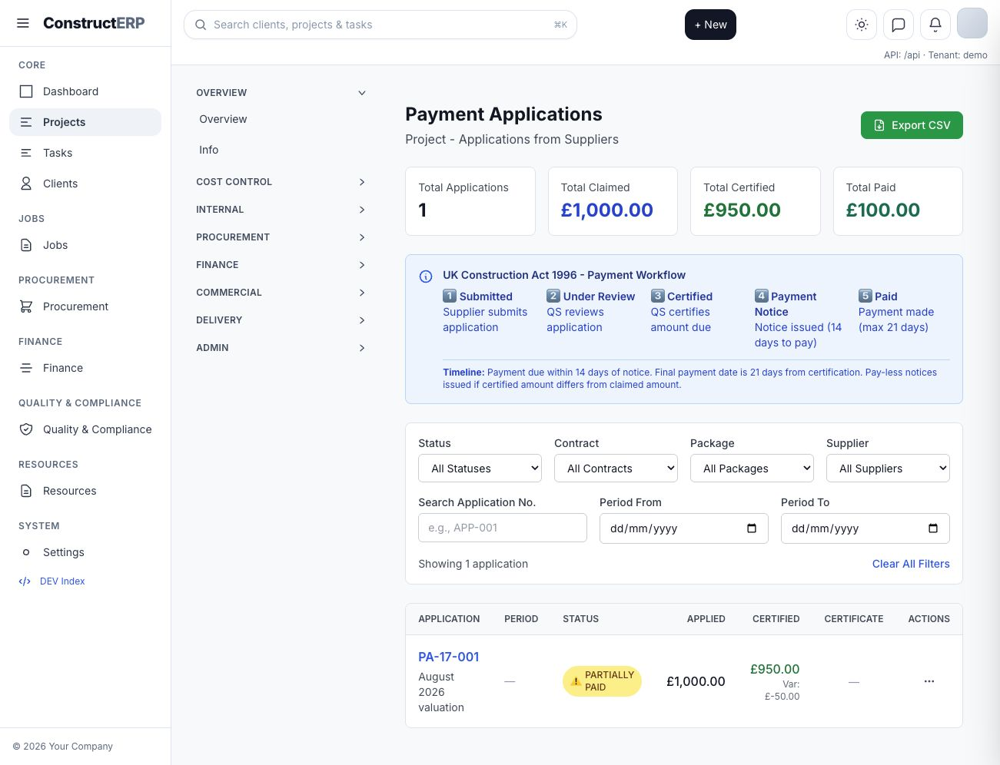
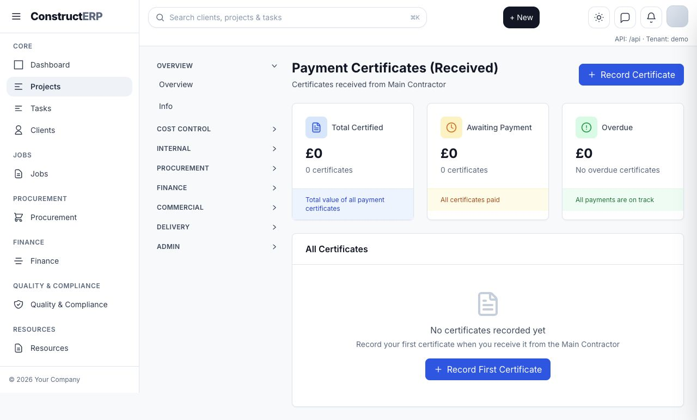
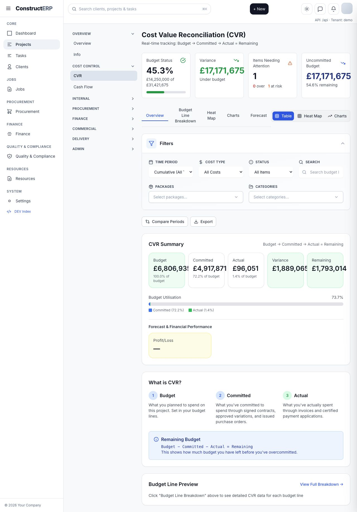
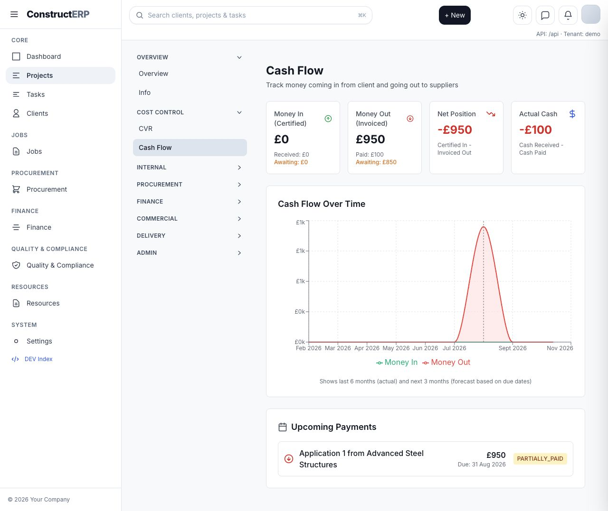

# Project Commercial Workflow Walkthrough

Captured from the local ERP on 24 August 2026:

- Frontend: `http://127.0.0.1:5173`
- API: `http://127.0.0.1:3001`
- Test project used: `Project 3 - Hospital Extension Project`

Use this as the simple end-to-end test route for budget to package to tender/award to contract to payment application, certificate, CVR and cash flow.

## 1. Start On The Project

Open `http://127.0.0.1:5173/projects/3/overview`.

Check:

- The project page loads without a red error banner.
- The project sidebar is visible.
- Cost Control, Internal, Procurement, Finance and Commercial areas are reachable from the project.

## 2. Check Budget Lines

Open `http://127.0.0.1:5173/projects/3/budgets`.

Check:

- Budget lines load with a total at the top.
- Budget line rows are visible.
- AI budget suggestions can open, but accepting suggestions into a live/awarded package must be blocked.

Control rule:

- A budget line can be edited while it is only a draft budget.
- Once it is inside a live package, tender, award, contract, payment application, invoice, certificate or CVR actual, the original budget should not be edited directly. A variation or reversal is needed.

## 3. Check Packages

Open `http://127.0.0.1:5173/projects/3/packages`.

Check:

- Packages show budget, supplier, status and contract state.
- `P3-01 - Preliminaries` is awarded/direct award and linked to a contract.
- `P3-03 - Superstructure` is in tender flow.
- Draft packages can still be shaped; awarded or tendered packages should not allow hidden scope/value changes.

## 4. Check Tender Flow

Open `http://127.0.0.1:5173/projects/3/tenders/4`.

Check each tab:

- Overview: tender summary is present.
- Invites: supplier invitations remain visible when switching tabs.
- Documents/Q&A/Submissions/Compare/Award: each tab can be opened without losing the tender context.

Control rule:

- Awarding from the tender should create an award and contract only if the package has not already been awarded and has no existing contract/finance activity.

## 5. Check Contracts

Open `http://127.0.0.1:5173/projects/3/contracts`.

Check:

- The direct award contract for `P3-01 - Preliminaries` is listed.
- Contract records are linked back to project, package and supplier.
- Commercial contract values and line items should be locked after draft/signing stages according to the contract route controls.

## 6. Check Purchase Orders And Invoices

Open `http://127.0.0.1:5173/projects/3/finance/invoices`.

Check:

- Invoice page loads without an error.
- Invoice records can be viewed from finance.
- Draft/open PO line edits recalculate the PO total.
- Issued/approved/paid finance records should not allow direct value edits.

Control rule:

- Open purchase orders can be corrected.
- Once a PO is issued/closed/paid, line and value edits should stop.
- Matched, approved or paid invoices should use workflow/reversal actions, not direct value edits.

## 7. Check Payment Applications

Open `http://127.0.0.1:5173/projects/3/finance/applications`.

Check:

- Existing payment applications load.
- `PA-17-001` is visible for the awarded `P3-01` contract.
- Submitted, certified or paid applications cannot be edited directly.

Tested control:

- Editing application `PA-17-001` returned `PAYMENT_APPLICATION_LOCKED_AFTER_SUBMISSION`.
- Deleting application `PA-17-001` returned `PAYMENT_APPLICATION_DELETE_BLOCKED`.

## 8. Check Payment Certificates

Open `http://127.0.0.1:5173/projects/3/finance/certificates`.

Check:

- Certificate page loads without an error.
- If certificates exist, accepted or paid certificates should not allow original certificate value edits.
- Dispute, accept and payment tracking should be used instead of direct edits after acceptance/payment.

## 9. Check CVR

Open `http://127.0.0.1:5173/projects/3/cvr`.

Check:

- CVR loads without a cash-flow or certificate table error.
- Budget lines, committed/certified/payment actuals and unallocated values are visible.
- The unallocated payment application row is visible if payment application lines have not been fully coded back to budget lines.

## 10. Check Cash Flow

Open `http://127.0.0.1:5173/projects/3/cash-flow`.

Check:

- Cash flow loads without the previous `PaymentCertificate` missing-table error.
- Money out includes the payment application/certified amount.
- Paid and awaiting balances are shown separately.

## Quick Regression Tests Run

These passed on 24 August 2026:

- Project packages loaded: `200`.
- Project payment applications loaded: `200`.
- Project payment certificates loaded: `200`.
- CVR loaded: `200`.
- Cash flow loaded: `200`.
- Locked payment application edit returned `409`.
- Locked payment application delete returned `409`.
- AI suggestion accept into awarded package returned `409`.
- Temporary open PO create, add line, edit line, total recalculation, line delete and PO cleanup passed.

## What To Watch For Next

- Frontend should present the new `409` commercial lock response as a friendly control message, not a raw API error.
- The next pass should add a visible “why locked” panel showing linked package, award, contract, invoice, application, certificate and CVR blockers.
- Any admin-only deletion/override UI should require a reason and show the audit impact before allowing the action.
